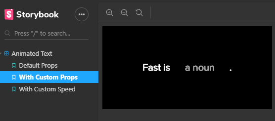

This project was bootstrapped with [Create React App](https://github.com/facebook/create-react-app).

## Overview

This project is about a text animator that receives a fixed text and a list of words to cycle. 

The component also is able to configure the speed of the animation and the width of the container of the cycled images.

## Available Scripts

In the project directory, you can run:

### `npm run storybook`

This command run the storybook toolset which shows two different themes for the component.

## Default properties:

## Custom Texts:

## Custom speed:

